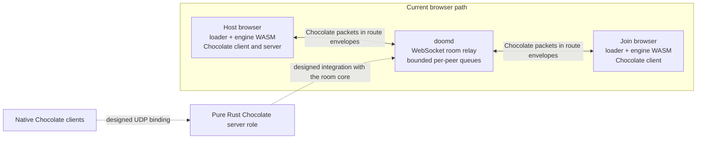

# doomit

DOOM, embeddable: a merged-lineage engine fork with restored Chocolate Doom multiplayer netcode, a browser loader, a bounded Rust WebSocket room relay, and Rust crate boundaries for protocol and native embedding work.

The current multiplayer path runs the Chocolate client and server roles inside browser engine instances. One browser hosts the game, while `doomd` relays opaque Chocolate packets between room members. The relay does not decode the Chocolate protocol or simulate the game.

Two browser instances can play shareware E1M1 through the relay. At the level exit, each engine computes separate input-history and simulation-state digests; the loader pages compare them and display component and aggregate verdicts. The loader also manages a deterministic PWAD set and applies changes by replacing the engine iframe.

## Architecture



Solid lines show the implemented browser path. Dashed lines show designed extension points that are not implemented: the engine tree retains SDL_net transport source but has no native build target, and the Rust crates do not contain the Chocolate server-role state machine or UDP binding.

## Layout

- `engine/`: GPL-2.0 engine fork, browser loader, restored Chocolate netcode, WebSocket transport, retained SDL_net transport source, deterministic canaries, and browser build/test recipes.
- `crates/doom-server/`: protocol-agnostic bounded rooms, the Cloudflare-compatible WebSocket envelope binding, and the `doomd` CLI.
- `crates/doom-proto/`: fixture-integrity checks and the boundary reserved for a byte-exact Chocolate protocol codec. The codec is not implemented.
- `crates/doom-embed/`: a buildable crate scaffold. A wasmtime host is not implemented.
- `fixtures/`: 102 curated datagrams from five Chocolate Doom 3.1.1 sessions, with capture/export tooling and provenance.
- `docs/`: the living design, observed protocol inventory, mod catalog, and reproduction notes.

The [design](docs/design.md) defines the component contracts and intended extensions. The selected PWAD validation set and its provenance are in [docs/mods.md](docs/mods.md).

Contributor conventions are in [CONTRIBUTING.md](CONTRIBUTING.md). Development history is confined to [CHANGELOG.md](CHANGELOG.md).

## Checks

```sh
./scripts/gate.sh
cd engine && npm test
```

The Rust gate checks formatting, runs warning-clean clippy, and runs the workspace tests. The engine suite exercises transport framing and ownership, ABI consistency, loader ordering and boundaries, input and state canaries, and multi-page verdict convergence. Browser build instructions, pinned emsdk version, artifact hashes, and provenance are in [`engine/docs/provenance.md`](engine/docs/provenance.md).

## Licensing

The engine fork under `engine/` is GPL-2.0 and follows the documented DOOM, Chocolate Doom, Crispy Doom, and wasm-doom lineage. The Rust crates are Apache-2.0 and written from scratch. Rust binaries do not link GPL engine object code; browser hosts load the separately licensed engine WebAssembly artifact as runtime data across a defined interface.
