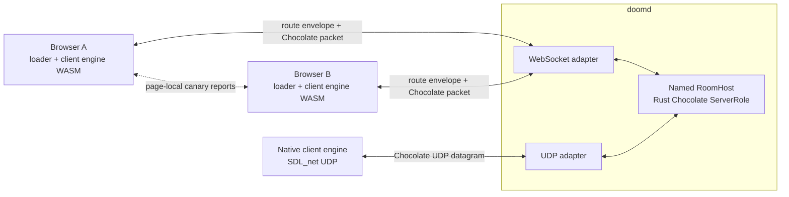

# doomit

DOOM, embeddable: a merged-lineage engine fork with restored Chocolate Doom multiplayer netcode, browser and native engine targets, a byte-exact Rust protocol codec, and a Rust server role shared by WebSocket and UDP clients.

Browser engines are clients only. `doomd` owns the WebSocket and UDP edge adapters, one shared `RoomHost` and Chocolate `ServerRole` per named room, protocol lifecycle, and tic fan-out. It never simulates the game.

The browser loader validates a pinned shareware IWAD, manages a deterministic PWAD set, launches the client-only engine, and compares separate input-history and simulation-state exit digests between two cooperating same-origin pages. Canary exchange stays page-local over `BroadcastChannel`; `doomd` does not compute verdicts.

## Architecture



All solid links are implemented. The dotted link is the cooperative same-origin canary channel between loader pages, outside the game server.

## Layout

- `engine/`: GPL-2.0 engine fork, client-only browser loader, native SDL_net target, restored Chocolate netcode, WebSocket transport, deterministic canaries, and build/test recipes.
- `runtime/`: pinned GPL browser-engine outputs and the unmodified shareware IWAD used by the Chan extension.
- `crates/doom-extension/`: the independently installed Chan adapter, scoped lobby, extension UI, and verified runtime-data server.
- `crates/doom-server/`: bounded room core, Chocolate server role, shared WebSocket and UDP `RoomHost` bindings, and the `doomd` CLI.
- `crates/doom-proto/`: byte-exact directional Chocolate packet codec plus fixture-integrity checks.
- `crates/doom-embed/`: a buildable crate scaffold. A wasmtime host is not implemented.
- `fixtures/`: 113 curated datagrams from seven Chocolate Doom 3.1.1 sessions, with capture/export tooling and provenance.
- `docs/`: the living design, observed protocol inventory, mod catalog, and reproduction notes.

The [design](docs/design.md) defines the current component contracts. The [Chan extension](docs/chan-extension.md) defines the adapter and host boundary. The selected PWAD validation set and its provenance are in [docs/mods.md](docs/mods.md).

Contributor conventions are in [CONTRIBUTING.md](CONTRIBUTING.md). Development history is confined to [CHANGELOG.md](CHANGELOG.md).

## Install the Chan extension

Chan v0.83.0 or newer discovers local extensions at `~/.chan/extensions`. Build and install Doomit plus its tracked runtime data with:

```sh
./scripts/install-chan-extension.sh
chan devserver --restart
```

The installer writes the executable under `~/.local/lib/doomit` and the declaration at `~/.chan/extensions/doomit.toml`. Override those roots with `DOOMIT_INSTALL_ROOT` and `CHAN_HOME` when running an isolated Chan instance.

## Checks

```sh
cargo test -p doom-proto --locked
cargo test -p doom-server --locked
./scripts/gate.sh
cd engine && npm test
```

The Rust checks cover codec round trips and malformed guards, the sans-I/O server lifecycle and tic windows, shared WebSocket/UDP room behavior, and the CLI. The engine suite covers transport framing and ownership, ABI consistency, loader boundaries, input and state canaries, and multi-page verdict convergence. Browser and native build instructions, the pinned emsdk version, artifact hashes, and provenance are in [`engine/docs/provenance.md`](engine/docs/provenance.md).

## Licensing

The engine fork under `engine/` and its generated files under `runtime/` are GPL-2.0 and follow the documented DOOM, Chocolate Doom, Crispy Doom, and wasm-doom lineage. The Rust crates are Apache-2.0 and written from scratch. Rust binaries do not link GPL engine object code; browser applications load the separately licensed engine WebAssembly artifact as runtime data across a defined interface. The unmodified shareware IWAD remains copyrighted Id Software data under the notice stored beside it.
