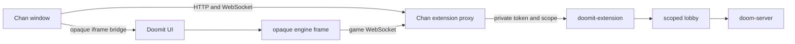

# Chan extension

Doomit can run as an independently installed Chan extension. Chan owns process discovery, single-origin proxying, session context, command dispatch, and presentation. Doomit owns the lobby, Doom server, engine lifecycle, and all Doom-specific state. Chan does not bundle the extension or its runtime data.

## Runtime topology

`doomit-extension` binds an ephemeral IPv4 loopback port, mints a bearer token, and prints a `CHAN_EXTENSION_V1` handshake. It serves the extension UI, a lobby control WebSocket, and a game WebSocket backed by `doom-server`. All room lookup comes from Chan's private `X-Chan-Extension-Scope`; browser messages and query parameters cannot select another scope.

The extension keeps one in-memory room per live Chan session. A room remains while a control connection exists and expires 30 seconds after the last control connection closes. There is no disk persistence. Standalone `doomd` and its native UDP interoperability remain separate.

## Lobby

The UI merges Chan's participant snapshot with Doom server state. Opening the tab does not join a game. Each window explicitly chooses Player or Spectator. Participant names and ephemeral launch tickets correlate UI and protocol peers for display only; Doom's oldest connected non-drone peer remains the authoritative controller.

The first Player claim is the provisional lobby owner until the Doom peer connects. The controller selects cooperative or deathmatch play and a target of two to four players. Every player launches with the same settings and `-nodes` target, retaining the engine's target-count auto-start. Spectators use drone mode, may join only before the match starts, and require an admitted player. Solo play bypasses the shared room.

The status model exposes adapter connectivity, room phase, controller, players, spectators, readiness, selected mode and target, runtime fingerprint, and the local window's state. Packet queues and operator diagnostics are not part of the extension UI.

## Host integration

The startup manifest requests a singleton tab and declares Play Solo, Join Session, Spectate, Leave Game, and Toggle Presentation commands. Chan assigns the global namespace and provides no default chords. Safe commands execute immediately. Leaving or replacing a running game requires confirmation in the Doomit UI.

The iframe sandbox remains opaque. The outer Doomit UI accepts host messages only from its exact parent window. It fetches the engine document and installs it as `srcdoc`, allowing the nested frame to stay under the opaque sandbox without weakening Chan's `frame-ancestors 'self'` response policy. The nested engine bridge accepts messages only from its exact frame window plus a fresh launch nonce. Wildcard target origins are necessary for opaque frames but never replace source and nonce checks. Host shortcut descriptors flow parent to outer frame to engine frame, and matching keydowns return along the reverse path.

Presentation promotes the same outer iframe into the browser top layer without reparenting it, so the engine, WebAssembly heap, and sockets survive entry and exit. A hidden tab mutes WebAudio without stopping simulation or networking. Escape remains a Doom key; Chan supplies explicit Restore and Close controls.

## Distribution

Linux, macOS, and Windows archives contain `doomit-extension`, the pinned browser engine files, the unmodified pinned shareware IWAD, required GPL source and attribution material, original shareware notices, and an example Chan declaration. Startup verifies every runtime-data hash before serving it. The engine and IWAD remain sidecar runtime data and are never linked into the Apache-licensed Rust binary.

The initial extension supports only the pinned shareware data set. PWAD transfer, mid-game spectators, native UDP peers in extension rooms, authenticated Chan identities, marketplace installation, and mobile controls are outside this contract.
