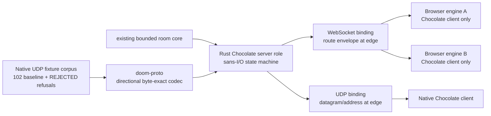

# M2: Rust server role and native interoperability

Status: ACTIVE. Round 1 is accepted. This plan covers the pure Rust Chocolate Doom server role, browser client-only operation, UDP native interoperability, and one deathmatch settings exercise.

## Outcome

Two browser engines use the Rust server role instead of running `NET_SV_*` inside either WebAssembly instance. The same sans-I/O server state machine is reachable through the WebSocket room binding and a native UDP binding. A pinned native Chocolate Doom 3.1.1 client can join it, and the server preserves byte-exact interoperability with the committed protocol evidence.

## Architecture

The room core continues to own names, membership, stable connection identities, bounded outboxes, and slow-consumer removal without parsing Chocolate packets. `doom-proto` owns only wire representation. The server-role state machine owns protocol lifecycle and reliability without sockets or async runtime types. WebSocket route identifiers and UDP socket addresses remain transport metadata outside the Chocolate codec.

## Deliverables

### Directional byte-exact codec

- Implement explicit big-endian readers and writers for the Chocolate 3.1.1 packet family documented in `docs/protocol.md`.
- Model client-to-server and server-to-client packets separately where the same type has different layouts.
- Cover SYN, REJECTED, KEEPALIVE, WAITING_DATA, LAUNCH, GAMESTART, GAMEDATA, GAMEDATA_ACK, DISCONNECT, DISCONNECT_ACK, RELIABLE_ACK, GAMEDATA_RESEND, CONSOLE_MESSAGE, QUERY, and QUERY_RESPONSE. Keep deprecated ACK and NAT_HOLE_PUNCH explicitly unsupported unless source evidence establishes a needed representation.
- Preserve every represented field required to decode and re-encode the complete committed corpus byte-for-byte, including the 102 baseline datagrams, new REJECTED evidence, volatile bytes, and Doom-unused bytes. Do not normalize captured garbage into invented defaults.
- Extend the capture rig with at least two deterministic connection-refusal causes against the real pinned chocolate-server and commit the resulting REJECTED packets with full provenance. Keep scratch IWAD/DEH inputs, binaries, and logs out of the repository. If a selected refusal is unreachable, record the source-backed reason and replace it with another independently caused refusal.
- Reject truncation, unterminated strings, impossible counts, size arithmetic overflow, invalid direction/layout combinations, and trailing bytes where the packet layout is exact.
- Use fixed-width field operations with no transmute, C-layout dependency, copied GPL implementation code, I/O, async runtime, or unsafe code.

### Rust Chocolate server role

- Add a deterministic sans-I/O state machine above `doom-proto` and beside the existing room registry.
- Accept an explicit peer identity, packet bytes or decoded client packet, and monotonic time; return explicit actions such as send, disconnect, and room/lobby updates.
- Implement negotiation, rejection, waiting-room state, controller launch, authoritative GAMESTART, ticcmd fan-out, acknowledgement windows, resend requests, reliable sequencing and retries, keepalives, timeouts, disconnect handshakes, and query responses.
- Preserve the room core's eight-connection bound while enforcing the Doom engine's four-player game limit from client capabilities.
- Bound each peer's reliable FIFO at 64 entries. The 65th enqueue disconnects that peer without growing the queue, an intentional abuse-path deviation from upstream's unbounded list.
- Validate IWAD, DEH, protocol, mission, game mode, and launch settings before admitting or starting peers.
- Keep simulation in the engines. The Rust server never advances Doom game state.

### WebSocket and UDP bindings

- Make the Rust server role the virtual room endpoint currently addressed as route ID 1. Browser clients keep the asymmetric little-endian WebSocket envelope, but no browser connection claims or implements the server route.
- Keep source-route ownership, room isolation, queue bounds, payload limits, and reset/disconnect behavior explicit when replacing the in-browser host.
- Add a UDP adapter that maps native datagram addresses to the same peer and server actions used by WebSocket clients.
- Expose both bindings from `doomd serve` with explicit listen configuration and no chan dependency. Each UDP listener maps unambiguously to one named room because the Chocolate datagram carries no room name.
- Use one room host and one server-role instance for WebSocket and UDP peers in the same named room. A mixed-transport lobby and GAMESTART are required evidence because they catch binding-specific semantic drift.

### Engine and loader transition

- Make the browser controller a Chocolate client with lobby/start authority, not an in-WebAssembly game server. Both browser instances connect to the Rust route endpoint.
- Remove `-privateserver` from the accepted browser path and prove `NET_SV_Init` is not invoked there. Preserve an explicit controller concept for LAUNCH and settings selection.
- Keep input-history and `DCS1` state canaries, iframe replacement, mod fingerprints, and the two-page verdict boundary unchanged unless the new launch identity requires a narrowly reviewed adjustment.
- Add the native engine build and retained SDL_net path described by `docs/design.md`, while using the pinned upstream Chocolate Doom 3.1.1 binary as the independent interoperability oracle.
- Preserve or deliberately re-pin the Emscripten build contract if the engine artifact changes.

## Evidence and acceptance

1. Every committed fixture decodes under its manifest direction and re-encodes to the exact original bytes. The corpus includes REJECTED packets from at least two distinct refusal causes produced by the real pinned chocolate-server. Mutation tests prove endian, length, count, string-termination, direction, reliable-sequence, and ticcmd-diff checks can fail.
2. Transcript tests drive the server state machine with committed client packets and compare its observable packet sequence and stable fields with the corresponding real chocolate-server fixture evidence. Volatile fields are compared by documented invariants rather than copied fixture values.
3. Deterministic state-machine tests cover valid handshake through tic exchange plus rejection, malformed input, reliable wrap/retry, resend, timeout, disconnect, room capacity, and slow-consumer behavior with a controlled clock.
4. A real pinned native Chocolate Doom 3.1.1 client connects over UDP to the Rust server, reaches lobby and GAMESTART, and exchanges game tics.
5. Two browser clients connect through the Rust WebSocket server role with no in-WebAssembly host, complete shareware E1M1, and report bilateral input and state matches.
6. Deathmatch is exercised once through a real GAMESTART path, with the authoritative `deathmatch = 1` setting observed by every participating engine and at least initial tic exchange completed.
7. The Rust gate, the engine suite, browser loader checks, clean-archive builds, and adversarial cross-lane reviews are green on the exact candidate commit.

## Sequence

1. Land the codec, the two-cause REJECTED capture extension, and the exact full-corpus round-trip gate while the server lane maps the state-machine seam and the engine lane opens the native build path.
2. Land the sans-I/O server lifecycle against the codec, then independently replay and mutate it before adding network runtimes.
3. Bind the accepted state machine to WebSocket and UDP, preserving one action model and one set of bounds across both transports.
4. Switch the browser loader to client-only operation and run native, mixed-transport, co-op, and deathmatch integration checks.
5. Reconcile current-reality docs, run the final clean-archive gate, and request host acceptance on the exact candidate.

## Ownership

- `@@proto`: `crates/doom-proto/`, fixture round-trip tests, and protocol evidence corrections.
- `@@server`: `crates/doom-server/`, server-role state machine, WebSocket integration, UDP binding, and `doomd`.
- `@@engine`: `engine/`, native build/SDL_net path, browser client-only transition, and engine-side integration evidence.
- `@@lead`: root dependency and lockfile integration, roadmap/current-doc reconciliation, cross-lane sequencing, independent gate, and host acceptance.

## Deferred

- Multiplayer determinism with PSX Doom's embedded DEHACKED patch remains required in M3.
- `doom-embed`, bot clients, the eight-connection soak, chan integration, NAT traversal, and authentication are outside this plan.
- The cooperative same-origin canary remains diagnostic evidence, not a security boundary.
